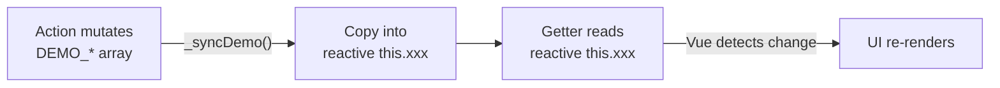

# Bagian 5: State Management (Pinia)

## Auth Store (§14.1)

### State
```ts
user: User | null
profile: Profile | null
loading: boolean
error: string | null
initialized: boolean
role: 'mahasiswa' | 'instruktur' | 'admin' | null
classList: ClassRoster[]     // Daftar kelas untuk dropdown login
studentRoster: StudentInfo[]  // Daftar mahasiswa per kelas
instructorList: Instructor[]  // Daftar instruktur
selectedLevel: number | null
selectedSession: string | null
demoMode: boolean             // true jika Supabase tidak dikonfigurasi
```

### Actions
```ts
initializeAuth()              // Cek session tersimpan
fetchClassList()              // Ambil daftar kelas (level + session)
fetchStudentRoster(level, session)  // Ambil daftar mahasiswa per kelas
fetchInstructorList()         // Ambil daftar instruktur
loginAsStudent(studentId)     // Login sebagai mahasiswa (by NPM/ID)
loginAsInstructor(instructorId)  // Login sebagai instruktur
logout()
fetchProfile()
updateProfile(data)
```

### Getters
```ts
isAuthenticated        // boolean
isStudent              // boolean (role === 'mahasiswa')
isInstructor           // boolean (role === 'instruktur')
userName               // string
userInitials           // string (untuk avatar)
dashboardRoute         // string: '/dashboard' atau '/instructor/dashboard'
```

---

## Course Store (§14.2)

### State
```ts
myCourses: CourseWithProgress[]   // Courses with progress info
selectedCourse: Course | null
lessons: LessonWithProgress[]     // Lessons with completion status
loading: boolean
error: string | null
searchQuery: string
```

### Actions
```ts
init()                                   // Fetch courses + enrollments
fetchLessons(courseId)                   // Ambil lesson list + progress
toggleLessonCompleted(lessonId)          // Toggle complete/uncomplete
```

### Getters
```ts
filteredCourses      // berdasarkan searchQuery
courseProgress       // Map courseId → %
completedLessons     // Set lessonId
```

---

## Assignment Store (§14.3)

### State
```ts
myAssignments: AssignmentWithCourse[]   // Assignments with course info
selectedAssignment: Assignment | null
mySubmissions: Submission[]             // Current user's submissions
loading: boolean
error: string | null
statusFilter: string
```

### Actions
```ts
init()                                   // Fetch assignments
fetchAssignmentById(id)                  // Ambil detail tugas
fetchSubmission(assignmentId)            // Ambil submission milik sendiri
submitAssignment(assignmentId, data)     // Submit jawaban
updateSubmission(assignmentId, data)     // Update submission
```

### Getters
```ts
pendingAssignments    // Not Submitted + Late
gradedAssignments     // Sudah dinilai
overdueAssignments    // Lewat deadline
```

---

## UI Store (§14.4)

### State
```ts
sidebarOpen: boolean
toast: { message: string, type: string } | null
theme: 'light' | 'dark'
```

### Actions
```ts
toggleSidebar()
showToast(message, type)
hideToast()
```

---

## Calendar Store (§14.5)

### State
```ts
events: AcademicEvent[]
loading: boolean
error: string | null
```

### Actions
```ts
init()                                // Fetch events (Supabase or demo data)
```

### Getters
```ts
allEvents              // All academic events sorted by date
todayEvents            // Events happening today
upcomingEvents         // Future events
eventsByMonth(year, month)  // Events in a specific month
```

---

## Attendance Store (§14.6)

### State
```ts
records: AttendanceWithNames[]  // Full attendance with student/course names
loading: boolean
error: string | null
isDemoMode: boolean
initialized: boolean
sbRecords: Attendance[]         // Supabase records
```

### Actions
```ts
init()                                                // Init store (check demo mode, fetch)
setAttendance(data)                                   // Upsert attendance record (create or update)
getOrCreateMeetingAttendance(courseId, pertemuan, tanggal)  // Get records for all students, fill defaults for missing
```

### Getters
```ts
allRecords                              // All records with student_name, student_npm, course_name
recordsByCourse(courseId)               // Filter by course
recordsByStudent(studentId)             // Filter by student
recordsByMeeting(courseId, pertemuan)   // Filter by course + meeting
recordsByDate(courseId, tanggal)        // Filter by course + date
totalMeetings(courseId)                 // Number of unique pertemuan for a course
studentStats(studentId, courseId)       // { total, hadir, izin, sakit, alpha, persentase }
```

---

## Demo Data Reactivity Pattern

### Why `_syncDemo()` Replaces `demoVersion`

Module-level `const` arrays (e.g. `const DEMO_COURSES = [...]`) are **not reactive** in Vue.
When a store action mutates them directly, Vue's `Proxy`-based reactivity cannot detect the change,
so getters that read from those arrays never recompute.

The old `demoVersion: number` counter was bumped on every mutation and read in getters via
`void this.demoVersion` — a side-channel to force getter re-evaluation. This is brittle and
breaks if a developer forgets to bump the counter.

### The New Pattern



| Step | What happens | Example |
|---|---|---|
| 1. **Seed on `init()`** | Copy demo data into Pinia reactive state | `this.courses = [...DEMO_COURSES]` |
| 2. **Getters read reactive state** | Vue tracks `this.xxx` automatically | `return this.isDemoMode ? this.courses : this.sbCourses` |
| 3. **`_syncDemo()` after mutations** | New array reference triggers Proxy traps | `this.courses = [...DEMO_COURSES]` |

The spread operator (`[...]`) is essential — it creates a **new array reference**. Without it,
`this.courses = DEMO_COURSES` would point to the same object and Vue would miss the update.

### Per-Store Adoption

| Store | Reactive state | Sync method | Notes |
|---|---|---|---|
| `courses.ts` | `this.courses` | `_syncDemo()` | Copies `[...DEMO_COURSES]` after every mutation |
| `assignments.ts` | `this.assignments`, `this.submissions` | `_syncDemo()` | Copies both arrays after every mutation |
| `quiz.ts` | `this.quizzes`, `this.questions`, `this.attempts` | `_syncState()` | Always creates new references from active data source |
| `attendance.ts` | `this.records` | `_syncDemo()` | Copies `[...DEMO_ATTENDANCE]` after every mutation |
| `announcements.ts` | `this.announcements` | _(inline)_ | Seeds `[...DEMO_ANNOUNCEMENTS]` in `init()` and after `addAnnouncement()` / `deleteAnnouncement()` |
| `auth.ts` | `this.students`, `this.instructors` | _(none needed)_ | Actions mutate `this.students` / `this.instructors` directly — they are the **source of truth**, not proxies for `DEMO_*` arrays |
| `calendar.ts` | `this.events` | _(none needed)_ | Actions mutate `this.events` directly — `init()` seeds once from `DEMO_EVENTS`; no separate module-level source |
| `ui.ts` | `sidebarOpen`, `darkMode`, `toasts` | _(none needed)_ | Pure UI state — no demo data, no `isDemoMode`, no Supabase backend |

### Checklist for Adding a New Demo-Data Store

1. Module-level `const DEMO_*` for static fallback data
2. Pinia state field for the reactive copy (e.g. `items: [] as Item[]`)
3. `_syncDemo()` helper that does `this.items = [...DEMO_ITEMS]`
4. `init()` calls `_syncDemo()` once (or seeds directly if `isDemoMode`)
5. Every action that mutates `DEMO_*` calls `this._syncDemo()` before returning
6. Getters read `this.items` — never `DEMO_ITEMS` directly
```
